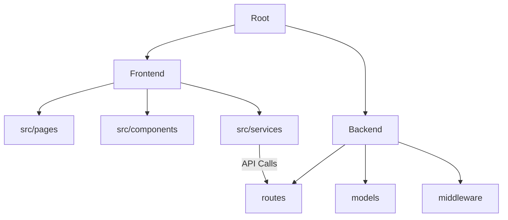

# MindMap AI – Predict Before You Break 🧠


> **AI-powered mental health tracking and burnout prediction platform.**

MindMap AI is a cutting-edge full-stack application designed to help users monitor their mental well-being, track daily triggers, and predict burnout risk before it happens. Using a combination of mood journaling and activity tracking, the platform provides actionable insights and AI-driven suggestions to maintain a healthy work-life balance.

---

## 🚀 Live Demo & Deployment

- **Frontend:** [mind-map-ai-zeta.vercel.app](https://mind-map-ai-zeta.vercel.app)
- **Backend API:** [mind-map-ai-backend.onrender.com](https://mind-map-ai-backend.onrender.com) (Example)

---

## 🎯 Key Features

- **🎭 Mood Logger:** Interactive emoji selector with daily journaling capabilities.
- **⚙️ Trigger Engine:** Track daily habits like screen time, sleep duration, and study hours.
- **📉 Burnout Risk Score:** Real-time AI analysis (0–100) with risk status (Low/Moderate/High).
- **📊 Interactive Dashboard:** Live charts using Recharts, stat cards, and a trigger detection panel.
- **🚨 SOS Button:** Quick-access emergency alert system for immediate support.
- **🤖 AI Suggestions:** Personalized tips based on your current stress levels and triggers.
- **🔐 Secure Auth:** Full user authentication with JWT and encrypted passwords.

---

## 🧠 Burnout Prediction Logic

The platform calculates your risk score based on daily activity and mood trends:

| Trigger | Impact |
|---|---|
| Screen time > 8h | **+20** points |
| Screen time > 12h | **+10** points |
| Sleep < 6h | **+30** points |
| Sleep < 4h | **+10** points |
| Study time > 10h | **+10** points |
| 3+ Negative Moods | **+40** points |
| 2 Negative Moods | **+20** points |
| 1 Negative Mood | **+10** points |
| Sleep ≥ 8h | **-10** points (Recovery) |

---

## 🛠️ Tech Stack

### Frontend
- **Framework:** React 19 + Vite 8
- **Styling:** Tailwind CSS 4 + Framer Motion (Animations)
- **Charts:** Recharts
- **Icons:** Lucide React
- **API Client:** Axios

### Backend
- **Runtime:** Node.js + Express 5
- **Database:** MongoDB + Mongoose 9
- **Auth:** JWT + Bcryptjs
- **Environment:** Dotenv + CORS
- **Dev Tool:** MongoDB Memory Server (Fallback)

---

## 📂 Project Structure



---

## ⚡ Quick Start

### 1. Clone the Repository
```bash
git clone https://github.com/your-username/MindMap-AI.git
cd MindMap-AI
```

### 2. Backend Setup
```bash
cd backend
npm install
# Create .env and add MONGO_URI, PORT, JWT_SECRET, FRONTEND_URL
npm run dev
```

### 3. Frontend Setup
```bash
cd frontend
npm install
# Create .env and add VITE_API_URL
npm run dev
```

---

## 📡 API Reference

| Method | Endpoint | Description |
|---|---|---|
| `POST` | `/api/auth/register` | User Registration |
| `POST` | `/api/auth/login` | User Login |
| `POST` | `/api/mood` | Log a mood entry |
| `GET` | `/api/mood/history` | Retrieve mood history |
| `POST` | `/api/activity` | Log daily activity |
| `GET` | `/api/predict` | Calculate burnout risk |
| `POST` | `/api/sos` | Trigger emergency alert |

---

## 🌐 Deployment Guide

### Frontend (Vercel)
1. Set Root Directory to `frontend/`.
2. Build Command: `npm run build`.
3. Output Directory: `dist`.
4. Environment Variables: `VITE_API_URL`.

### Backend (Render)
1. Set Root Directory to `backend/`.
2. Build Command: `npm install`.
3. Start Command: `npm start`.
4. Environment Variables: `MONGO_URI`, `PORT`, `FRONTEND_URL`.

---

## 📄 License
This project is licensed under the **ISC License**.

Created with ❤️ by **Antigravity**.
